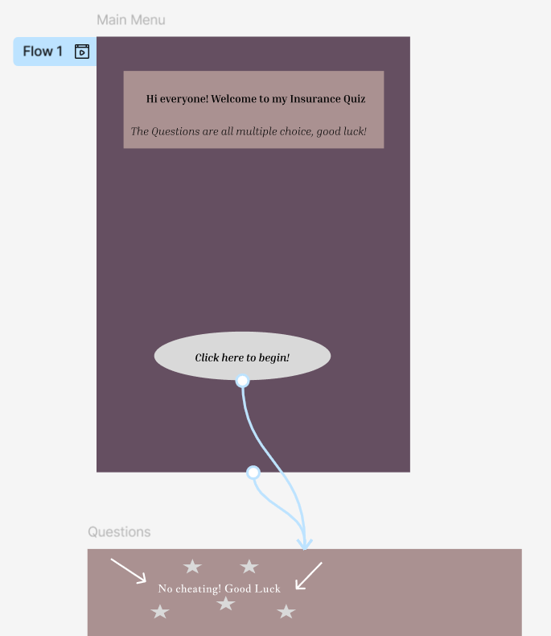
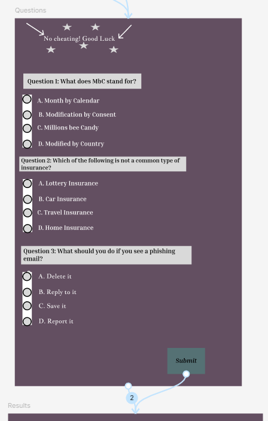
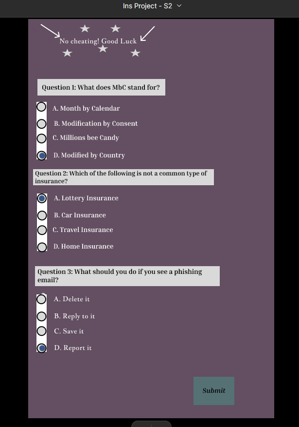
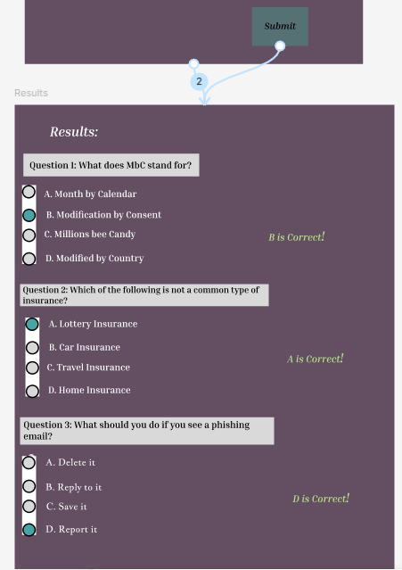
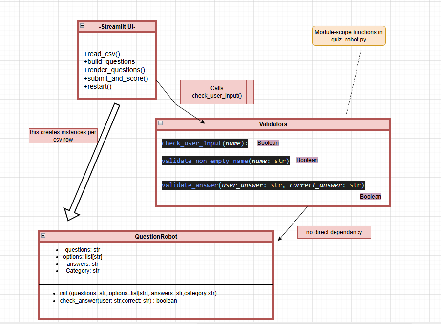
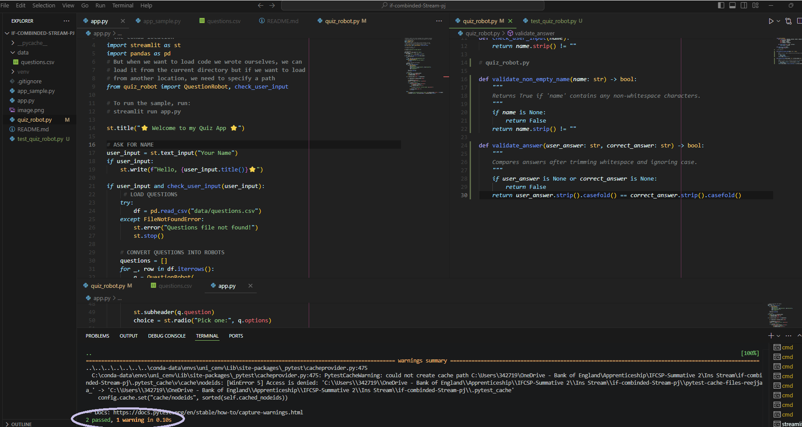
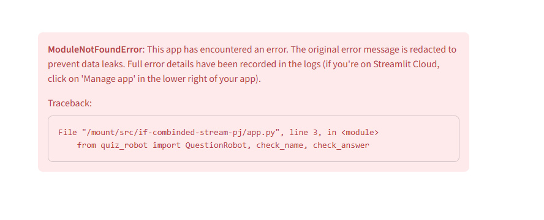

# if-combinded-Stream-pj
if-combinded-stream-pj

## Welcome to my project Quiz! 

## 🧠 Introduction:
In my role as an Administrator, a large part of my work involves supporting colleagues, organising information, and helping ensure that our internal procedures are followed correctly. Many of these procedures relate to areas such as data protection, communication standards, reporting expectations, and general workplace conduct. Because staff work across different teams and often handle a variety of tasks, it is important that everyone has a clear and consistent understanding of the organisation’s policies. When this knowledge isn’t consistent, it can lead to mistakes, delays, or confusion. For this reason, tools that help reinforce organisational understanding are valuable.

This project presents a simple organisational knowledge quiz designed to support staff learning in a straightforward and accessible way. The quiz allows employees to check their understanding of key workplace topics through multiple‑choice questions and receive instant feedback. It can be used for onboarding, refresher training, or general confidence‑building. I have created for this assignment a version which is a Minimum Viable Product (MVP) as mentioned in the assignment brief. This means it is a basic but fully functional first version containing only the essential features needed to demonstrate how the quiz works. 

The development of this quiz also demonstrates real programming practices, including the use of Python and Streamlit, version control with GitHub, object‑oriented design, CSV data storage, input validation, exception handling, and basic unit testing. Overall, the project shows how a small digital tool can support organisational learning while applying modern development techniques.

## 🎨 Design Section:
The graphical user interface for the quiz was designed using Figma to plan the layout, user flow, and visual structure before coding began. The design focuses on simplicity and accessibility to ensure staff members can complete the quiz without technical difficulty.

Screens included in the Figma design:

* Welcome Screen/ Main menu: User enters the 'Begin Quiz' Button.
* Quiz Screen: Displays one multiple‑choice question at a time with radio‑button options.
* Results Screen: Shows the final score and provides an option to download or export results.

*The Link to my figma is here:* https://www.figma.com/design/gErTTKRUDsx6SzQKSBuN5q/Ins-Project---S2?node-id=7-5&t=b2gwsuUTx54PvE37-1 

### Here is my screenshot of the Main Menu screen:


#### Above you can see that the Main Menu doesnt ask for a name rather just asks to click the button to begin the quiz
 * this was made as i thought as the app required a name, I thought of other ways i can create/design my quiz and one was through making it anonymous
 * Therefore, my figma design quiz didnt ask for a name to begin a quiz just like how an anonymous form wouldnt require one

I chose to do this because i thought this would also help people answer the questions comfortably as they wouldnt need to worry if people knew what answers they got as it would be anonymous - although again this was made just for people to learn more about their role in a comfortable safe environment.

### Here is screenshot of the Questions page:


* Over here I used and went through how to create an interactive radio button for my MCQ

**Which then looks like this when run 🐾:**

where i can also click on the answers and then press submit at the bottom right corner

And finally... 
### shows my Results page 💥: 


* With the correct answers!! 🔥

## **Function Requirements** *(What the app must do)*
1. Firstly the system must collect the users name before starting the quiz and display a greeting shown here:

```user_input = st.text_input("Your Name")
if user_input:
    st.write(f"Hello, {user_input.title()}⭐")
```
* When a user enters any non-empty string, the greeting renders with .title() formatting.
* Empty input prodcues nothing - no greeting and no quiz content

2. Load questions from CSV
The system will load questions from data/questions.csv
```
pd.read_csv("data/questions.csv")
```
* On successful load, a DataFrame is created and iterated to build question objects.
* If the file is missing, the app shows st.error("Questions file not found!") and stops.

3. Enforce Questions Data Schema
The CSV must include the following columns: question, option1, option2, option3, correct_answer, category.
For instance: Field access in the for _, row in df.iterrows(): block.

For each row, the app constructs a QuestionRobot(question, [option1, option2, option3], correct_answer, category) without KeyError.
If any required column is missing, the app presents a descriptive error and stops.


4. Instantiate Question Objects
The system must convert all CSV rows into QuestionRobot instances and store them in memory.
Source (code): 
```List construction questions.append(q)
```
* The number of created QuestionRobot objects equals the number of rows in the CSV.
* Each object exposes: .question, .options, .answer, .category.

5. Track Quiz State (Index + Score)
The system must track the current question index and user score across interactions.
Source (code): (*st.session_state.index, st.session_state.score*)
* When the app starts, if state keys don’t exist, they initialize to 0.
* State persists between user interactions until the quiz ends or is restarted.

6. Render Question and Options
The system must present the current question with three options and let the user select one.
Example: 
```
st.subheader(q.question) and st.radio("Pick one:", q.options)
```
* Exactly one option can be selected per question.
* The UI label “Pick one:” is displayed consistently.


7. Submit Answer and Evaluate
The system must evaluate the selected answer via the question object.
Example: q.check_answer(choice, q.answer)

* On clicking Submit, the app evaluates the chosen option.
 - Correct answer → st.success("Correct!") and increments score by 1.
- Incorrect answer → st.error(f"Incorrect. Correct answer: {q.answer}") without score change.
* After evaluation, the app advances to the next question and reruns (st.rerun()).

8. Complete Quiz and Show Final Score
When all questions have been answered, the app must display a final score.
```
End-of-quiz else block
```
- Final message: You finished the quiz! Score: X / N
A Restart button is rendered on completion.

9. Restart Quiz
Finally, the system must allow the user to restart the quiz from the beginning.

Shown here:
```
st.button("Restart", on_click=lambda: st.session_state.clear())
```
By clicking Restart, this clears session state so index and score reset to fresh values.
The UI returns to the name input stage.

## **Non - Function Requirements** *(How the app should perform)*

1. Performance
Quiz Loading and interactions should be fast and smooth
2. Reliability
Missing files or invalid data must show clear error messages
3. Usability
The code should be simple, readable and easy to use
4. Compatibility
This works on Python 3.10+ using Streamlit
5. Maintainability
UI logic stays in app.py, quiz logic in quiz_robot
6. Portability
App runs via Streamlit run app.py using relative paths

### **Here is a Class diagram on my code design**



## 🏹 Development Section: 
The development of this organisational knowledge quiz followed a structured and incremental approach, beginning with the separation of application logic and the graphical user interface. This separation was important for clarity and maintainability, but also because it allowed the functional logic to be independently tested without relying on the Streamlit interface. All quiz logic was placed inside *quiz_robot.py*, while the user interface and control flow were implemented in *app.py*. I created a sample app.py using the tutorial video in module 12 Lesson 1 and 2 which can also be shown in my Github respository.
The main object-oriented component of the project is the Question_Robot class, which serves as a simple container for individual questions. Each question is represented by four pieces of information: the question text, the list of possible options, the correct answer, and its category. Encapsulating this in a class ensures that every question is created in a consistent format and can be easily passed through the quiz engine. This approach also demonstrates fundamental object‑oriented practices such as abstraction and data grouping.
Pure functions were created in the logic file to support input validation and answer checking. For example, **validate_non_empty_name()** ensures that the user provides a non‑blank name before the quiz begins. Likewise, **validate_answer()** compares the user’s selected option against the correct answer. These functions have no side effects and always return the same output when given the same input, making them suitable for unit testing. The predictability of these functions strengthens the reliability of the quiz flow.
Exception handling was also added to increase robustness. The quiz loads questions from a CSV file, so file‑related errors are likely scenarios. To handle this, the application uses try/except blocks when reading from the CSV. If the file is missing, or  incorrectly formatted/labelled,  the app displays a user‑friendly error message instead of crashing. Similar protection is used when saving results to results.csv, particularly in cases where a user might have the file open in Excel, preventing writing.
The Streamlit interface in *app.py* controls user interaction. It displays the quiz one question at a time, using session state to retain progress between reruns. When the user submits an answer, the app checks it using the validation logic in quiz_robot.py, updates their score, and proceeds to the next question. At the end of the quiz, the app provides the final score and allows the user to download their results.
Overall, the development approach ensured a clear separation between logic and presentation, supported maintainability, and satisfied the assignment’s requirements for OOP, validation, exception handling, and persistent data storage.

## 🧪 Testing Section:
A combined testing strategy was used to validate both the internal logic of the quiz and the overall user experience. The structure of the project, with logic kept separate from the GUI, made it possible to test functional correctness independently from the interface. Two types of testing were performed: manual testing and automated unit testing using pytest.
**For example:**

*Here is a snippet of my pytest.*
 Unit testing was implemented using pytest to validate the pure functions inside quiz_robot.py. These tests ensure that input validation behaves consistently and that the answer‑checking logic correctly distinguishes between right and wrong answers. Because these functions do not rely on Streamlit or other external components, they are easy to test in isolation.

**Another example is Manual Testing:**
Manual testing focused on verifying the full workflow within the Streamlit interface. This included checking that the name input field behaved correctly, ensuring that the quiz loaded the first question properly, validating that buttons functioned as expected, and confirming that results were saved to the CSV file. Additional manual tests involved intentionally triggering error conditions, such as renaming the questions file to test whether the error message appeared correctly. These tests ensured that exception handling behaved as intended and that no user‑facing crashes occurred.
A summary of manual tests:
Test Case	Expected Outcome	Actual Outcome	Result
Start without entering name	Warning displayed	Warning appeared	Pass
Load quiz with correct CSV present	First question loads	Works correctly	Pass
Submit answer	Moves to next question	Works correctly	Pass
Wrong answer selected	Correct feedback shown	Works correctly	Pass
questions.csv removed	Error message shown	Works correctly	Pass
Final score displayed	Score accurate	Correct	Pass
Download results	CSV downloaded	Works correctly	Pass

## 🗒 Documentation:
**User Documentation**:
The quiz is degined for staff in my team who want to test/refresh their knowledge on the organisational policies and procedures. To begin the quiz, the user enters their name on the welcome screen and clicks the start button. The quiz then displays one multiple‑choice question at a time, using radio buttons for answer selection. After choosing an option, the user presses “Submit” to move to the next question. Once all questions have been answered, the user is shown their final score and offered the option to download their results as a CSV file. The quiz is intended to be simple, intuitive, and accessible to users of all digital skill levels.

**Technical documentation**:
The application is developed using Python and Streamlit. The project includes two main files: quiz_robot.py for quiz logic and app.py for the user interface. Questions and results are stored in CSV files inside a data folder.
*To run the application locally:*
pip install -r requirements.txt
streamlit run app.py
*To run automated tests*
pytest
*To update the questions:*
Edit the questions.csv file and ensure the following column names remain unchanged:
question,option1,option2,option3,correct_answer,category
The quiz will automatically load new questions when relaunched but can also be edited in the code.

## 📈 Evaluation:

The development of this quiz provided practical experience in applying a full software development workflow, from design and implementation to testing and documentation. One of the aspects that went particularly well was the use of Streamlit, as it enabled rapid interface development without needing to build complex HTML or JavaScript components. The combination of Python logic and Streamlit’s state management created a smooth and interactive quiz experience.
Creating a separate logic file (quiz_robot.py) was another positive decision, as it made the code easier to understand and test. Implementing pure functions for validation proved beneficial during unit testing because their predictable behaviour ensured stable results and made debugging straightforward. Additionally, using CSV files for storing data made testing and updating content simple and accessible, even for non‑technical team members.
However, several challenges emerged during development. Streamlit’s rerun behaviour required careful state management to prevent questions from resetting or skipping. Import issues early on also caused delays, especially when files were not stored correctly within the project folder. Ensuring that exception handling covered all possible failure scenarios required repeated testing and refinement.
For example shown here:


If given more time, several improvements could be made. These include randomising question order, improving accessibility features, adding quite more of a broader questions as well as adding progress indicators. Expanding the quiz with additional categories and difficulty levels would also enhance its usefulness.

Overall, this project improved my confidence in Python, testing, version control, and interface design. It demonstrated how a simple quiz can support organisational learning while reinforcing essential development skills.

### Links:
Figma: https://www.figma.com/design/gErTTKRUDsx6SzQKSBuN5q/Ins-Project---S2?node-id=7-5&p=f&t=b2gwsuUTx54PvE37-0

GitHub: https://github.com/Undroid88/if-combinded-Stream-pj

